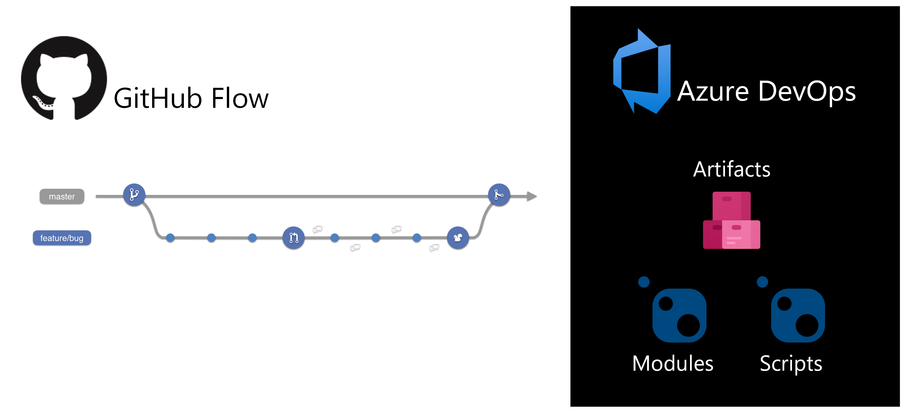

# powershell-poc

This is a proof of concept on how you can develop, build, and package PowerShell projects within GitHub leverage [GitHub flow and techniques][github-services-workflow-guide] and [Azure DevOps Artifacts][azure-devops-artifacts].



This project aims to satisfy several goals in its design:

1. Building and releasing PowerShell scripts and modules as software artifacts
1. Creating repeatable processes that can be reviewed and audited
1. Integrating into native PowerShell workflows
1. Support phased deployment and rollback of installed scripts and modules
1. Minimizing management of additional in-network resources
1. Secure secret management

## Why recommend Azure DevOps Artifacts?

As of October 2021, the [PowerShellGet 3.0 beta with NuGet v3 support][powershellget-nuget-support] has a couple of known issues using [NuGet-based GitHub Packages][packages-nuget] as a PowerShell repository:

- https://github.com/PowerShell/PowerShellGet/issues/163
- https://github.com/OneGet/oneget/issues/430

This only impacts PowerShell projects; developers on `dotnet` projects leverage `nuget` and `dotnet nuget` CLIs with NuGet GitHub Packages repositories as expected:

- [GitHub Packages: Private NuGet Packages via GitHub Actions][example-dotnet]
- [Example script for publishing a PowerShell module to the NuGet GitHub Package Registry][example-powershellget-01]
- [How To Setup A Github Actions Pipeline For Publishing Your PowerShell Module (to PowerShell Gallery)][example-powershellget-02]
- [Consuming a NuGet package from GitHub Packages][example-nuget-samsmithnz]

[Azure DevOps Artifacts][azure-devops-artifacts] is the only [managed PowerShell repository solution with NuGet v2 support][powershell-private-repo-hosting] recommended by Microsoft capable of supporting private PowerShell repositories.

## Supported PowerShell versions in GitHub Actions

[GitHub-hosted runners][actions-supported-runners] have support for PowerShell 5.1 and/or 7.x depending on the virtual machine type and [shell][actions-shells] used:

| Virtual machine \ PowerShell version                     | 5.1          | 7.x    | Per-minute rate | End of life                                |
| -------------------------------------------------------- | ------------ | ------ | --------------: | ------------------------------------------ |
| [macos-10.15][actions-virtual-environment-macos-1015]    |              | `pwsh` |          $0.08  |                                            |
| [macos-11][actions-virtual-environment-macos-11]         |              | `pwsh` |          $0.08  |                                            |
| [ubuntu-18.04][actions-virtual-environment-ubuntu-1804]  |              | `pwsh` |          $0.008 |                                            |
| [ubuntu-20.04][actions-virtual-environment-ubuntu-2004]  |              | `pwsh` |          $0.008 |                                            |
| [windows-2016][actions-virtual-environment-windows-2016] | `powershell` | `pwsh` |          $0.016 | [March 15, 2022][actions-windows-2016-eol] |
| [windows-2019][actions-virtual-environment-windows-2019] | `powershell` | `pwsh` |          $0.016 |                                            |
| [windows-2022][actions-virtual-environment-windows-2022] | `powershell` | `pwsh` |          $0.016 |                                            |

For differences and history around PowerShell 5.1 _(Desktop)_ and 7.x _(Core)_, [read more][powershell-version-differences].

For information on how GitHub-hosted runners are billed, [read more][actions-billing].

<details>
  <summary>For confirming the version of PowerShell</summary>

  The following action workflow will show both PowerShell 5.1 and 7.x are installed on `windows-*` runners:

  ```
  on:
    workflow_dispatch:
  jobs:
    check-powershell-versions:
      strategy:
        matrix:
          runner:
            - windows-2016
            - windows-2019
            - windows-2022
      runs-on: ${{ matrix.runner }}
      steps:
        - run: |
            Get-Host
          shell: powershell

        - run: |
            Get-Host
          shell: pwsh
  ```

  resulting in:

  ```
  Name             : ConsoleHost
  Version          : 5.1.20348.230
  InstanceId       : b6a8f124-9444-4c21-9af8-5299d854b274
  UI               : System.Management.Automation.Internal.Host.InternalHostUserInterface
  CurrentCulture   : en-US
  CurrentUICulture : en-US
  PrivateData      : Microsoft.PowerShell.ConsoleHost+ConsoleColorProxy
  DebuggerEnabled  : True
  IsRunspacePushed : False
  Runspace         : System.Management.Automation.Runspaces.LocalRunspace
  ```

  and

  ```
  Name             : ConsoleHost
  Version          : 7.1.5
  InstanceId       : 58ae196a-c589-4e2f-aa78-c1b76f69cf1e
  UI               : System.Management.Automation.Internal.Host.InternalHostUserInterface
  CurrentCulture   : en-US
  CurrentUICulture : en-US
  PrivateData      : Microsoft.PowerShell.ConsoleHost+ConsoleColorProxy
  DebuggerEnabled  : True
  IsRunspacePushed : False
  Runspace         : System.Management.Automation.Runspaces.LocalRunspace
  ```
</details>

## PowerShell repository structure

This repository is a proof of concept and it is evolving as we learn from others and exercise ideas.  One of those areas is the relation of repository design and building artifacts.

- [Invoke-Automation "PowerShell Scaffolding – How I build modules"][building-modules-invokeautomation]
- [PowerShell Explained "PowerShell: Adventures in Plaster"][building-modules-powershellexplained]
- [Rambling Cookie Monster "Building a PowerShell Module"][building-modules-ramblingcookiemonster]
- [Adam the Automator "Understanding and Building PowerShell Modules"][building-modules-adamtheautomator]

This repository has been designed to support multiple modules and/or scripts:

```
├── docs                #  documentation, images, and other assets
│   └── assets
│
├── modules             #  directory containing modules, will publish on merge to main
│   └── PSHello
│       ├── Private     #  directory containing module's private functions that should not be exported
│       ├── Public      #  directory containing module's public functions that should be exported
│       └── en-US       #  directory containing module's help docs (en-US locale)
│
├── scripts             #  directory containing scripts, will publish on merge to main
│
└── tests               #  directory containing tests for modules and scripts
```

### Creating new PowerShell scripts and modules

**Creating new scripts**

Scripts are contained within the [`scripts`](scripts/) directory and are published individually when merged to the `main` branch.

Scripts should be created using the [`New-ScriptFileInfo` cmdlet][powershell-new-scriptfileinfo] and include basic information like:

```powershell
$scriptFileInfo = @{
  Path = "./scripts/PSHelloWrapper.ps1"
  Version = "0.0.1"
  Author = "andyfeller@github.com"
  Description = "Simple wrapper around PSHello module"
}

New-ScriptFileInfo @scriptFileInfo
```

**Creating new modules**

Modules are contained within the [`modules`](modules/) directory and are published individually when merged the `main` branch.

Modules should be created using the [`New-ModuleManifest` cmdlet][powershell-new-modulemanifest] and include basic information like:

```powershell
$moduleManifest = @{
	Path = "./modules/PSHello/PSHello.psd1"
	Version = "0.0.1"
  Author = "andyfeller@github.com"
  Description = "Simple module to print Hello world!"
}

New-ModuleManifest @moduleManifest
```

### Releasing PowerShell scripts and modules

The modules and scripts contained in the above directories will be released whenever changes are merged to the `main`
branch.  In order to make it easier for contributors, modules and scripts will be released with the revision portion of
their version set to the action run number before publishing.  Ideally, contributors would update the version whenever
changes are made, but to err is human.

Want to give special thanks to @agazoth's ["Increment Build and Version in PSake"][building-modules-agazoth] article as it highlighted the use of [`Update-ModuleManifest`][powershell-update-modulemanifest] and [`Update-ScriptFileInfo`][powershell-update-scriptfileinfo] to update version numbers in the release process!

## Setup

### Prerequisites

- [Azure DevOps account][azure-devops]

### Setup Azure DevOps Artifacts for published scripts and modules

The following is how a maintainer would setup the necessary [Azure DevOps Artifacts feed and tokens for private PowerShell repository][azure-devops-artifacts-powershell] this proof of concept is based on:

1. [Create Azure DevOps Artifacts feed and personal access token (PAT) for CI][azure-devops-artifacts-powershell]

   <details>
     <summary>Only <b>Packaging (Read & Write)</b> permissions needed</summary>

     
   </details>

   <details>
     <summary>Consider disabling any unnecessary Azure DevOps services</summary>

     
   </details>

   <details>
     <summary>Azure Artifact feeds support both NuGet v2 and v3 APIs</summary>

     Replacing `/v3/index.json` with `/v2/` should allow this feed to be used by PowerShellGet.

     
   </details>

1. Create GitHub Actions secret with Azure DevOps Artifacts PAT

   <details>
     <summary>GitHub Action secrets are obscured in runner logs</summary>

     
   </details>

### Setup host where scripts and modules will be installed

1. Ensure strong cryptography (TLS 1.2) is enabled for [Azure DevOps][azure-devops-tls]

   As of Febuary 2020, [Azure DevOps Artifacts requires hosts have TLS 1.2 supported][azure-devops-tls], which was a response to [changing PCI compliance standards][pci-tls-12].

   <details>
     <summary>To confirm whether TLS 1.2 supported is enabled</summary>

     ```powershell
     [Net.ServicePointManager]::SecurityProtocol
     Tls, Tls11, Tls12
     ```
   </details>

   <details>
     <summary>To enable TLS 1.2 support</summary>

     ```powershell
     Set-ItemProperty -Path 'HKLM:\SOFTWARE\Microsoft\.NETFramework\v4.0.30319' -Name SchUseStrongCrypto -Value 1 -PropertyType 'Dword' -Force | Out-Null
     Set-ItemProperty -Path 'HKLM:\SOFTWARE\Microsoft\.NETFramework\v4.0.30319' -Name SystemDefaultTlsVersions -Value 1 -PropertyType 'Dword' -Force | Out-Null

     If ([System.Environment]::Is64BitOperatingSystem) {
       Set-ItemProperty -Path 'HKLM:\SOFTWARE\WOW6432Node\Microsoft\.NETFramework\v4.0.30319' -Name SchUseStrongCrypto -Value 1 -PropertyType 'Dword' -Force | Out-Null
       Set-ItemProperty -Path 'HKLM:\SOFTWARE\WOW6432Node\Microsoft\.NETFramework\v4.0.30319' -Name SystemDefaultTlsVersions -Value 1 -PropertyType 'Dword' -Force | Out-Null
     }
     ```

     Afterwards, close and reopen PowerShell terminal.
   </details>

1. Install [SecretManagement][secretmanagement] and [SecretStore][secretstore] modules from the PowerShell Gallery to securely hold credentials:

   ```powershell
   Install-Module Microsoft.PowerShell.SecretManagement, Microsoft.PowerShell.SecretStore -Repository PSGallery
   ```

1. Create secret vault for storing Azure DevOps Artifacts credentials:

   ```powershell
   Register-SecretVault -Name powershell-poc -ModuleName Microsoft.PowerShell.SecretStore -DefaultVault
   ```

1. Create secrets in secret vault for authenticating to Azure DevOps Artifacts:

   ```powershell
   Set-Secret -Name powershell-poc-username
   Set-Secret -Name powershell-poc-password

   $credential = New-Object -TypeName PSCredential -ArgumentList (Get-Secret powershell-poc-username), (Get-Secret powershell-poc-password)
   Set-Secret -Name powershell-poc-credential -Secret $credential
   ```

   You will be prompted for a password to secure a secret vault the first time a secret is saved:

   ```
   Creating a new powershell-poc vault. A password is required by the current store configuration.
   Enter password:
   ********************
   Enter password again for verification:
   ********************
   ```

1. [Register PowerShell repository][powershell-register-psrepository] using the read-only packages PAT

   ```powershell
   $psRepository = @{
     Name = "powershell-poc"
     SourceLocation = "https://pkgs.dev.azure.com/andyfeller/powershell-poc/_packaging/powershell-poc/nuget/v2"
     ScriptSourceLocation = "https://pkgs.dev.azure.com/andyfeller/powershell-poc/_packaging/powershell-poc/nuget/v2"
     InstallationPolicy = "Trusted"
     Credential = (Get-Secret powershell-poc-credential)
   }

   Register-PSRepository @psRepository
   Get-PSRepository
   ```

1. Install and invoke `PSHello` module:

   ```powershell
   Install-Module PSHello -Repository powershell-poc -Credential (Get-Secret powershell-poc-credential)
   Write-PSHelloWorld
   ```

1. Install and invoke `PSHelloWrapper` script:

   ```powershell
   Install-Script PSHelloWrapper -Repository powershell-poc -Credential (Get-Secret powershell-poc-credential)
   Get-InstalledScript | Format-List *
   ```

[actions-billing]: https://docs.github.com/en/billing/managing-billing-for-github-actions/about-billing-for-github-actions
[actions-customize-runners]: https://docs.github.com/en/actions/using-github-hosted-runners/customizing-github-hosted-runners
[actions-shells]: https://docs.github.com/en/actions/learn-github-actions/workflow-syntax-for-github-actions#using-a-specific-shell
[actions-supported-runners]: https://docs.github.com/en/actions/using-github-hosted-runners/about-github-hosted-runners#supported-runners-and-hardware-resources
[actions-virtual-environment-macos-1015]: https://github.com/actions/virtual-environments/blob/main/images/macos/macos-10.15-Readme.md
[actions-virtual-environment-macos-11]: https://github.com/actions/virtual-environments/blob/main/images/macos/macos-11-Readme.md
[actions-virtual-environment-ubuntu-1804]: https://github.com/actions/virtual-environments/blob/main/images/linux/Ubuntu1804-README.md
[actions-virtual-environment-ubuntu-2004]: https://github.com/actions/virtual-environments/blob/main/images/linux/Ubuntu2004-README.md
[actions-virtual-environment-windows-2016]: https://github.com/actions/virtual-environments/blob/main/images/win/Windows2016-Readme.md
[actions-virtual-environment-windows-2019]: https://github.com/actions/virtual-environments/blob/main/images/win/Windows2019-Readme.md
[actions-virtual-environment-windows-2022]: https://github.com/actions/virtual-environments/blob/main/images/win/Windows2022-Readme.md
[actions-windows-2016-eol]: https://github.blog/changelog/2021-10-19-github-actions-the-windows-2016-runner-image-will-be-removed-from-github-hosted-runners-on-march-15-2022/
[azure-devops-artifacts-powershell]: https://docs.microsoft.com/en-us/azure/devops/artifacts/tutorials/private-powershell-library?view=azure-devops
[azure-devops-artifacts]: https://azure.microsoft.com/en-us/services/devops/artifacts/
[azure-devops-tls]: https://devblogs.microsoft.com/devops/azure-devops-services-to-require-tls-1-2/
[azure-devops]: https://azure.microsoft.com/en-us/services/devops/
[building-modules-adamtheautomator]: https://adamtheautomator.com/powershell-modules/#Adding_PSRepositories
[building-modules-agazoth]: https://agazoth.github.io/blogpost/2018/09/12/Increment-Build-and-Version-in-PSake.html
[building-modules-invokeautomation]: https://invoke-automation.blog/2019/09/24/powershell-scaffolding-how-i-build-modules/
[building-modules-powershellexplained]: https://powershellexplained.com/2017-05-12-Powershell-Plaster-adventures-in/
[building-modules-ramblingcookiemonster]: http://ramblingcookiemonster.github.io/Building-A-PowerShell-Module/
[chocolatey]: https://community.chocolatey.org/
[devblogs-secretmanagement-secretstore-preview]: https://devblogs.microsoft.com/powershell/secrets-management-module-vault-extensions/
[devblogs-secretmanagement-secretstore-release]: https://devblogs.microsoft.com/powershell/secretmanagement-and-secretstore-are-generally-available/
[dotnet-install]: https://docs.microsoft.com/en-us/dotnet/core/tools/dotnet-install-script
[example-dotnet]: https://geoffhudik.com/tech/2020/10/04/github-packages-private-nuget-packages-via-github-actions/
[example-nuget-samsmithnz]: https://samlearnsazure.blog/2021/08/08/consuming-a-nuget-package-from-github-packages/
[example-powershellget-01]: https://gist.github.com/Badgerati/ecec3629cdc4c326ac3c8ba0fb99fe5a
[example-powershellget-02]: https://scriptingchris.tech/2021/05/16/how-to-setup-a-github-actions-pipeline-for-publishing-your-powershell-module/
[github-services-workflow-guide]: https://github.github.com/services-workflow-guide/#/
[invokeautomation]: https://github.com/jpsider/Invoke-Automation/
[packages-nuget]: https://docs.github.com/en/packages/working-with-a-github-packages-registry/working-with-the-nuget-registry
[pci-tls-12]: https://www.docusign.com/blog/developers/preparing-tls-11-removal
[pester]: https://github.com/pester/Pester
[plaster]: https://github.com/PowerShellOrg/Plaster
[powershell-about-comment-based-help]: https://docs.microsoft.com/en-us/powershell/module/microsoft.powershell.core/about/about_comment_based_help?view=powershell-7.1
[powershell-about-format]: https://docs.microsoft.com/en-us/powershell/module/microsoft.powershell.core/about/about_format.ps1xml?view=powershell-7.1
[powershell-about-powershell-exe]: https://docs.microsoft.com/en-us/powershell/module/microsoft.powershell.core/about/about_powershell_exe?view=powershell-5.1
[powershell-install]: https://docs.microsoft.com/en-us/powershell/scripting/install/installing-powershell?view=powershell-7.1
[powershell-new-modulemanifest]: https://docs.microsoft.com/en-us/powershell/module/microsoft.powershell.core/new-modulemanifest?view=powershell-7.1
[powershell-new-scriptfileinfo]: https://docs.microsoft.com/en-us/powershell/module/powershellget/new-scriptfileinfo?view=powershell-7.1
[powershell-private-repo-hosting]: https://docs.microsoft.com/en-us/powershell/scripting/gallery/how-to/working-with-local-psrepositories?view=powershell-7.1#use-packaging-solutions-to-host-powershellget-repositories
[powershell-register-psrepository]: https://docs.microsoft.com/en-us/powershell/module/powershellget/register-psrepository?view=powershell-5.1
[powershell-secret-credentials]: https://www.thomasmaurer.ch/2021/04/stop-typing-powershell-credentials-in-demos-using-powershell-secretmanagement/
[powershell-update-modulemanifest]: https://docs.microsoft.com/en-us/powershell/module/powershellget/update-modulemanifest?view=powershell-7.1
[powershell-update-scriptfileinfo]: https://docs.microsoft.com/en-us/powershell/module/powershellget/update-scriptfileinfo?view=powershell-7.1
[powershell-version-differences]: https://docs.microsoft.com/en-us/powershell/scripting/whats-new/differences-from-windows-powershell?view=powershell-7.1
[powershellgallery-plaster]: https://www.powershellgallery.com/packages/Plaster/
[powershellgallery-publishing-guidelines]: https://docs.microsoft.com/en-us/powershell/scripting/gallery/concepts/publishing-guidelines?view=powershell-7.1
[powershellgallery-publishing-guidelines]: https://docs.microsoft.com/en-us/powershell/scripting/gallery/concepts/publishing-guidelines?view=powershell-7.1
[powershellget-nuget-support]: https://devblogs.microsoft.com/powershell/powershellget-3-0-preview-11-release/
[secretmanagement]: https://github.com/powershell/secretmanagement
[secretstore]: https://github.com/powershell/secretstore
[powershell-get-installedscript]: https://docs.microsoft.com/en-us/powershell/module/powershellget/get-installedscript?view=powershell-7.1
[powershell-get-installedmodule]: https://docs.microsoft.com/en-us/powershell/module/powershellget/get-installedmodule?view=powershell-7.1
